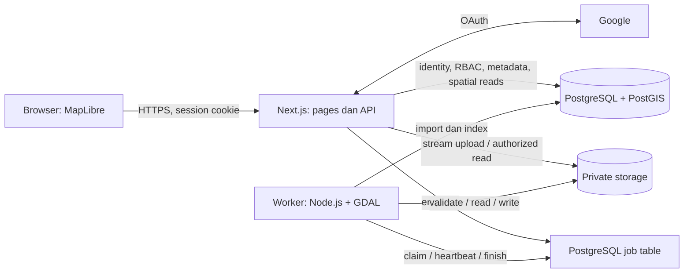

# Rencana Company GIS Web Portal

Status: **Phase 1, Phase 2 GIS Viewer dan Phase 3 User Management sudah diimplementasikan. Phase 4 menambahkan upload/import Shapefile, worker dan manajemen layer dasar; verifikasi akhir perubahan Phase 4 masih berlangsung. Raster dan fitur lanjutan yang tidak disebut dalam cakupan Phase 4 tetap rancangan fase berikutnya**.

Dokumen ini awalnya dibuat ketika repository masih kosong sebagai rancangan keseluruhan portal GIS internal. Instruksi implementasi berikutnya menetapkan **Phase 1** sebagai Next.js/TypeScript/Tailwind, PostgreSQL/PostGIS, ORM/migration, Docker Compose, Google OAuth, user/status/role, bootstrap `SUPER_ADMIN_EMAILS`, dan protected routes server-side. Scope eksplisit tersebut menggantikan pembagian fondasi/authentication pada roadmap awal.

Implementasi saat ini menyediakan `/login`, `/pending`, `/access-denied`, dan GIS Viewer `/map` (Phase 2). Permintaan lanjutan pengguna menambahkan **Account approvals** di `/admin`: administrator dapat menyetujui akun PENDING sebagai APPROVED/VIEWER melalui browser, dengan pemeriksaan izin server dan audit transaksional. Petunjuk menjalankan aplikasi dan pengujian ada di [README.md](README.md). MapLibre, katalog layer, layanan MVT, panel GIS dan pengukuran tersedia tanpa seed data. Phase 3 menambahkan dashboard, `/admin/users`, approve/reject/change role, filter/pencarian dan proteksi administrator. Phase 4 menambahkan `/admin/upload`, `/admin/layers`, antrean PostgreSQL, worker GDAL, import SHP ke EPSG:4326, metadata/visibility/delete layer dan cleanup. Diagram, schema raster, fitur pencarian/style lanjutan dan acceptance criteria fase berikutnya di bawah tetap merupakan rancangan, bukan pernyataan bahwa semua fitur tersebut sudah tersedia.

## 1. Analisis kebutuhan dan batas lingkup

### Tujuan

Membangun portal GIS perusahaan yang hanya menampilkan data kepada pengguna Google dengan status `APPROVED`. Authentication membuktikan identitas; authorization menentukan akses berdasarkan status dan role terbaru di database.

| Area | Kebutuhan wajib |
| --- | --- |
| Identitas | Google OAuth melalui Auth.js; tidak ada username/password authentication. |
| Persetujuan | Pengguna baru `PENDING/VIEWER`; administrator menyetujui atau menolak. |
| Portal | `/map` dengan MapLibre GL JS, navbar, sidebar, basemap, layer, legenda, pencarian, popup, dan kontrol peta. |
| Administrasi | `/admin` dengan Dashboard, Users, Layers, Upload Data, dan Audit Log. |
| Vector | Unggah ZIP Shapefile, validasi di server, import melalui GDAL/ogr2ogr ke PostGIS. |
| Raster | Unggah GeoTIFF, simpan file secara privat, baca metadata, dan tampilkan raster pada peta. |
| Keamanan | Pemeriksaan server pada setiap akses privat, validasi input, sesi aman, CSRF, audit, dan pembatasan resource. |
| Operasional | Docker Compose, migration terkontrol, local storage, README dan jalur migrasi ke storage S3-compatible. |

### Matriks akses

| Kemampuan | Tanpa sesi | PENDING / REJECTED | APPROVED VIEWER | APPROVED ADMIN |
| --- | --- | --- | --- | --- |
| Login Google | Ya | Ya | Ya | Ya |
| Melihat status akun / logout | Tidak | Ya | Ya | Ya |
| Map, katalog layer, legenda, basemap | Tidak | Tidak | Ya | Ya |
| Tile, atribut, pencarian data GIS | Tidak | Tidak | Ya | Ya |
| Menyalakan/mematikan layer pada tampilan sendiri | Tidak | Tidak | Ya | Ya |
| Upload, edit, style, visibility global, delete layer | Tidak | Tidak | Tidak | Ya |
| Daftar pengguna, approve, reject, change role | Tidak | Tidak | Tidak | Ya |
| Dashboard admin dan audit log | Tidak | Tidak | Tidak | Ya |

Role `ADMIN` dengan status selain `APPROVED` tetap tidak mempunyai akses GIS maupun administrasi.

### Keputusan lingkup awal

- Gunakan satu aplikasi Next.js dengan satu database; tidak memerlukan microservices atau Redis.
- Semua approved viewer mendapatkan katalog yang sama. ACL per divisi/proyek/layer, multi-tenancy, editing geometri, dan analisis spasial lanjutan berada di luar MVP.
- ZIP Shapefile dan GeoTIFF merupakan format upload wajib. Enum `GEOJSON` dan `POSTGIS` disediakan pada schema; upload GeoJSON dan registrasi sumber PostGIS tambahan dapat menyusul. Aplikasi belum menerima connection string atau SQL dari pengguna.
- `layers.is_visible` berarti layer tersedia secara global bagi viewer. Jika false, server tidak memberikan katalog maupun datanya kepada viewer; admin boleh mem-preview. Toggle milik viewer hanya mengubah tampilan browser, bukan nilai database.
- Satu ZIP berisi satu dataset Shapefile. **Implementasi Phase 4 mewajibkan `.prj` yang dikenali dan menolak CRS tidak diketahui**; pilihan EPSG manual dalam rancangan awal belum diimplementasikan. Sistem tidak mengasumsikan EPSG:4326 sebagai CRS asal.
- Bahasa awal antarmuka mengikuti teks requirement; pesan pending persis **"Your account is waiting for administrator approval."**. Bahasa tambahan dapat dikembangkan kemudian.
- Angka batas resource di dokumen ini merupakan default awal untuk diuji, bukan kapasitas yang sudah dibuktikan.

## 2. Proposal arsitektur

### Komponen

| Komponen | Pilihan dan tanggung jawab |
| --- | --- |
| Web dan API | Next.js App Router, TypeScript strict, Tailwind CSS; server components untuk halaman dan route handlers untuk API. |
| Map | MapLibre GL JS dalam client component yang dimuat hanya di browser. |
| Authentication | Auth.js, Google provider saja, database session, adapter Drizzle untuk PostgreSQL. |
| Database | PostgreSQL + PostGIS; Drizzle untuk tabel aplikasi dan migration, SQL terparameterisasi untuk query spasial. |
| Validasi | Schema input bersama, misalnya Zod, tetap dijalankan di server. |
| GIS worker | Proses Node.js/TypeScript terpisah di codebase yang sama, menjalankan executable GDAL/ogr2ogr tanpa shell. |
| Job queue | Tabel PostgreSQL dengan claim atomik, lease, heartbeat, retry, dan status; tanpa broker tambahan. |
| Storage | Interface storage dengan implementasi lokal; file berada di volume privat di luar `public/`. |
| Deployment | Compose untuk `app`, `worker`, `db`, serta perintah migration satu kali. HTTPS melalui reverse proxy perusahaan saat deployment. |

Versi Node.js LTS, Next.js, Auth.js, Drizzle, PostgreSQL/PostGIS, GDAL, dan image Docker dipilih sebagai kombinasi stabil yang kompatibel pada fase fondasi, lalu dipin beserta lockfile. Jangan menggunakan tag `latest` untuk deployment. Kompatibilitas adapter Auth.js dengan database session harus dibuktikan sebelum membangun fitur di atasnya.



`J` adalah tabel di database `D`, bukan service database kedua. App dan worker berbagi module domain, kontrak storage, dan volume, tetapi mempunyai proses serta hak database yang berbeda. GDAL tidak dijalankan di browser atau di dalam request upload yang panjang.

### Alur login dan authorization

1. Pengguna membuka login dan memilih Google. Scope minimum: `openid email profile`.
2. Auth.js menangani OAuth state, PKCE/nonce sesuai provider, callback, dan session cookie. Callback aplikasi menolak profil tanpa `sub` atau email yang terverifikasi.
3. Identitas utama adalah `(provider = google, provider_account_id = sub)`. Jangan melakukan penggabungan akun otomatis berdasarkan email saja dan jangan aktifkan `allowDangerousEmailAccountLinking`.
4. Adapter membuat user baru dengan default database `PENDING/VIEWER`. `google_id` disinkronkan dari akun Google yang telah terhubung; nama, email, dan gambar hanya berasal dari profil terverifikasi.
5. Service onboarding pada lifecycle sign-in menyelesaikan sinkronisasi identitas, bootstrap bila berlaku, dan audit `LOGIN` sebelum login dianggap selesai. Kegagalan sinkronisasi tidak memberikan akses GIS. Urutan callback/event adapter ini menjadi integration test fase authentication.
6. Email Google terverifikasi yang cocok tepat dengan `SUPER_ADMIN_EMAILS` mendapatkan `APPROVED/ADMIN`. Normalisasi daftar menggunakan trim dan lowercase; tidak boleh substring atau wildcard domain.
7. Session menyimpan referensi user. Server selalu membaca user terbaru saat authorization; status atau role yang dibawa frontend/session bukan sumber otoritas.
8. `PENDING` diarahkan ke `/pending`, `REJECTED` ke `/access-denied`, dan `APPROVED` ke `/map`. Halaman status menyediakan logout dan pemeriksaan status kembali.

Helper server yang dipakai bersama:

- `requireSession()` memastikan sesi database masih berlaku dan user ada.
- `requireApprovedUser()` juga memastikan status `APPROVED` dan identitas Google lengkap.
- `requireAdmin()` juga memastikan role `ADMIN`.
- `requireLayerAccess()` memastikan layer siap, tersedia untuk role tersebut, serta belum dihapus/dinonaktifkan.

Middleware hanya membantu redirect. Route handlers, server actions jika digunakan, dan service yang melakukan mutasi tetap memeriksa izin. Jangan melakukan cache lintas request atas hasil authorization. API mengembalikan `401` jika tanpa sesi dan `403` jika izin tidak cukup.

### Bootstrap admin dan perubahan akun

- `SUPER_ADMIN_EMAILS=admin@company.com` adalah contoh konfigurasi, bukan credential atau akun bawaan.
- Sesuai requirement, email yang masih tercantum akan dipromosikan lagi saat login berikutnya. Hapus alamat dari konfigurasi setelah bootstrap bila demotion/rejection harus tetap berlaku. UI admin harus menjelaskan apabila akun masih terikat konfigurasi bootstrap.
- Bootstrap mencatat `USER_APPROVED` dan `ROLE_CHANGED` dengan actor sistem serta alasan `bootstrap`. `approved_by` boleh null untuk jalur ini.
- Login ulang user biasa tidak mengembalikan role/status ke default dan tidak membatalkan keputusan admin.
- Approval menetapkan `approved_by` dan `approved_at`; rejection mengosongkan kedua field karena keduanya mewakili approval yang aktif. Riwayat tersimpan di audit.
- Perubahan role hanya untuk akun approved. Status/role dicek dari DB pada request berikutnya; rejection juga menghapus sesi aktif pengguna.
- Cegah penolakan atau demotion approved admin terakhir, termasuk dua request bersamaan. Gunakan lock transaksi global khusus perubahan administrator, lalu hitung ulang approved admin di dalam transaksi.
- Tidak ada aturan pendaftar pertama otomatis menjadi admin. Konflik email dengan Google identity berbeda ditolak dan ditangani sebagai konflik akun, bukan digabung diam-diam.

## 3. Proposal database schema

Schema `app` menyimpan data aplikasi. Schema `gis` menyimpan tabel hasil import yang dipublikasikan; `gis_staging` menampung pekerjaan worker dan tidak dapat dibaca role web. Extension PostGIS diaktifkan oleh migration role. UUID dibuat server/database, waktu memakai `timestamptz`, dan audit/metadata tidak berisi credential.

SQL berikut adalah rancangan schema lengkap **di dalam dokumen**. Migration executable Phase 1 berada di `migrations/` dan mencakup identitas, sesi, audit, PostGIS, serta izin database; katalog layer sudah dibuat pada Phase 2; tabel job/upload/raster di rancangan ini belum diimplementasikan. Gunakan file migration untuk menjalankan aplikasi, bukan menyalin SQL rancangan ini ke database.

```sql
CREATE EXTENSION IF NOT EXISTS postgis;
CREATE SCHEMA IF NOT EXISTS app;
CREATE SCHEMA IF NOT EXISTS gis;
CREATE SCHEMA IF NOT EXISTS gis_staging;

CREATE TYPE app.user_status AS ENUM ('PENDING', 'APPROVED', 'REJECTED');
CREATE TYPE app.user_role AS ENUM ('VIEWER', 'ADMIN');
CREATE TYPE app.layer_type AS ENUM ('VECTOR', 'RASTER');
CREATE TYPE app.source_type AS ENUM ('SHP', 'GEOJSON', 'GEOTIFF', 'POSTGIS');
CREATE TYPE app.layer_state AS ENUM ('PROCESSING', 'READY', 'FAILED', 'DELETING');
CREATE TYPE app.job_state AS ENUM ('QUEUED', 'RUNNING', 'SUCCEEDED', 'FAILED');

CREATE TABLE app.users (
    id uuid PRIMARY KEY DEFAULT gen_random_uuid(),
    name text,
    email text NOT NULL UNIQUE,
    image text,
    google_id text UNIQUE,
    email_verified timestamptz,
    status app.user_status NOT NULL DEFAULT 'PENDING',
    role app.user_role NOT NULL DEFAULT 'VIEWER',
    approved_by uuid REFERENCES app.users(id) ON DELETE SET NULL,
    approved_at timestamptz,
    created_at timestamptz NOT NULL DEFAULT now(),
    updated_at timestamptz NOT NULL DEFAULT now(),
    CHECK (email = lower(btrim(email))),
    CHECK (
        (status = 'APPROVED' AND approved_at IS NOT NULL
            AND google_id IS NOT NULL AND email_verified IS NOT NULL)
        OR (status <> 'APPROVED' AND approved_at IS NULL AND approved_by IS NULL)
    )
);
CREATE INDEX users_status_created_idx ON app.users (status, created_at DESC);

-- Nama kolom dipetakan ke kontrak Auth.js oleh schema adapter Drizzle.
CREATE TABLE app.accounts (
    user_id uuid NOT NULL REFERENCES app.users(id) ON DELETE CASCADE,
    type text NOT NULL CHECK (type IN ('oauth', 'oidc')),
    provider text NOT NULL CHECK (provider = 'google'),
    provider_account_id text NOT NULL,
    refresh_token text,
    access_token text,
    expires_at bigint,
    token_type text,
    scope text,
    id_token text,
    session_state text,
    PRIMARY KEY (provider, provider_account_id),
    UNIQUE (user_id, provider)
);

CREATE TABLE app.sessions (
    session_token text PRIMARY KEY,
    user_id uuid NOT NULL REFERENCES app.users(id) ON DELETE CASCADE,
    expires timestamptz NOT NULL
);
CREATE INDEX sessions_user_idx ON app.sessions (user_id);
CREATE INDEX sessions_expires_idx ON app.sessions (expires);

CREATE TABLE app.layers (
    id uuid PRIMARY KEY DEFAULT gen_random_uuid(),
    name varchar(200) NOT NULL,
    description text NOT NULL DEFAULT '',
    layer_type app.layer_type NOT NULL,
    source_type app.source_type NOT NULL,
    table_name text UNIQUE,
    file_path text,
    srid integer,
    source_srid integer,
    source_crs_wkt text,
    style_json jsonb NOT NULL DEFAULT '{}'::jsonb,
    is_visible boolean NOT NULL DEFAULT true,
    uploaded_by uuid NOT NULL REFERENCES app.users(id),
    created_at timestamptz NOT NULL DEFAULT now(),
    updated_at timestamptz NOT NULL DEFAULT now(),
    state app.layer_state NOT NULL DEFAULT 'PROCESSING',
    geometry_type text,
    feature_count bigint,
    bbox geometry(Geometry, 4326),
    storage_metadata jsonb NOT NULL DEFAULT '{}'::jsonb,
    CHECK (char_length(btrim(name)) > 0),
    CHECK (srid IS NULL OR srid > 0),
    CHECK (source_srid IS NULL OR source_srid > 0),
    CHECK (feature_count IS NULL OR feature_count >= 0),
    CHECK (jsonb_typeof(style_json) = 'object'),
    CHECK (jsonb_typeof(storage_metadata) = 'object'),
    CHECK (table_name IS NULL OR table_name ~ '^layer_[0-9a-f]{32}$'),
    CHECK (
        (layer_type = 'VECTOR' AND source_type IN ('SHP', 'GEOJSON', 'POSTGIS')
            AND table_name IS NOT NULL)
        OR (layer_type = 'RASTER' AND source_type = 'GEOTIFF'
            AND table_name IS NULL AND file_path IS NOT NULL)
    ),
    CHECK (state <> 'READY' OR bbox IS NOT NULL),
    CHECK (layer_type <> 'VECTOR' OR state <> 'READY'
        OR (srid IS NOT NULL AND srid = 4326))
);
CREATE INDEX layers_catalog_idx ON app.layers (state, is_visible, created_at DESC);
CREATE INDEX layers_uploader_idx ON app.layers (uploaded_by);
CREATE INDEX layers_bbox_idx ON app.layers USING gist (bbox);

CREATE TABLE app.gis_jobs (
    id uuid PRIMARY KEY DEFAULT gen_random_uuid(),
    layer_id uuid REFERENCES app.layers(id) ON DELETE SET NULL,
    requested_by uuid NOT NULL REFERENCES app.users(id),
    operation text NOT NULL CHECK (
        operation IN ('IMPORT_VECTOR', 'IMPORT_RASTER', 'REBUILD_RASTER', 'DELETE_LAYER')
    ),
    state app.job_state NOT NULL DEFAULT 'QUEUED',
    attempts integer NOT NULL DEFAULT 0 CHECK (attempts >= 0),
    max_attempts integer NOT NULL DEFAULT 3 CHECK (max_attempts > 0),
    available_at timestamptz NOT NULL DEFAULT now(),
    lease_until timestamptz,
    lock_token uuid,
    progress integer NOT NULL DEFAULT 0 CHECK (progress BETWEEN 0 AND 100),
    payload jsonb NOT NULL DEFAULT '{}'::jsonb,
    error_code text,
    error_message text,
    created_at timestamptz NOT NULL DEFAULT now(),
    updated_at timestamptz NOT NULL DEFAULT now(),
    started_at timestamptz,
    finished_at timestamptz,
    CHECK (jsonb_typeof(payload) = 'object')
);
CREATE INDEX gis_jobs_claim_idx ON app.gis_jobs (available_at, created_at)
    WHERE state = 'QUEUED';
CREATE INDEX gis_jobs_expired_lease_idx ON app.gis_jobs (lease_until)
    WHERE state = 'RUNNING';
CREATE UNIQUE INDEX gis_jobs_active_layer_idx ON app.gis_jobs (layer_id)
    WHERE state IN ('QUEUED', 'RUNNING');

CREATE TABLE app.audit_logs (
    id uuid PRIMARY KEY DEFAULT gen_random_uuid(),
    user_id uuid REFERENCES app.users(id) ON DELETE SET NULL,
    action text NOT NULL,
    target_type text NOT NULL,
    target_id text,
    timestamp timestamptz NOT NULL DEFAULT now(),
    metadata jsonb NOT NULL DEFAULT '{}'::jsonb,
    request_id uuid,
    CHECK (jsonb_typeof(metadata) = 'object')
);
CREATE INDEX audit_logs_time_idx ON app.audit_logs (timestamp DESC, id);
CREATE INDEX audit_logs_actor_idx ON app.audit_logs (user_id, timestamp DESC);
CREATE INDEX audit_logs_target_idx ON app.audit_logs (target_type, target_id, timestamp DESC);
```

### Aturan schema dan pemetaan

- `users` mencakup seluruh field requirement. `email_verified`, `accounts`, dan `sessions` merupakan kebutuhan integrasi Auth.js. Field `email_verified` dipetakan ke `emailVerified` pada adapter.
- `google_id` boleh null hanya pada tahap sementara saat adapter membuat user sebelum menautkan Google account. Sinkronisasi harus selesai sebelum akses GIS; constraint melarang user approved tanpa identitas terverifikasi. Ini menghindari asumsi bahwa `createUser` dan `linkAccount` adapter merupakan satu operasi atomik.
- Simpan email dalam lowercase pada semua jalur adapter/service. Hubungan `users.google_id = accounts.provider_account_id` dijaga oleh service onboarding dalam transaksi dan integration test.
- Google hanya dipakai untuk login. Scope tidak meminta akses API Google atau offline access. Kolom token standar adapter tetap nullable; wrapper adapter membuang access/refresh/ID token sebelum persistence karena tidak dibutuhkan. Session token database tetap rahasia dan tidak pernah ditulis ke log.
- Password, password hash, dan endpoint reset password tidak dibuat. Tabel verification token untuk magic link tidak diperlukan karena fitur tersebut tidak dipakai.
- `updated_at` diperbarui konsisten melalui trigger migration untuk `users`, `layers`, dan `gis_jobs`; SQL trigger dibuat pada fase implementasi. Insert dan transisi state dilakukan melalui service transaksi yang tervalidasi.
- `srid` menyatakan CRS data tersimpan: vector dinormalisasi ke EPSG:4326; raster asli mempertahankan CRS sumber. `source_srid` dan WKT mempertahankan provenance. Raster dengan CRS WKT valid tanpa kode EPSG boleh mempunyai SRID null; CRS yang hilang/tidak dapat ditransformasikan ditolak atau memerlukan input eksplisit.
- `bbox` menyimpan footprint dalam EPSG:4326 untuk pencarian/fit extent; gunakan geometri footprint yang sesuai termasuk titik, garis, dan area lintas antimeridian, bukan memaksa semua bbox menjadi polygon biasa.
- Nama tabel disimpan tanpa schema, selalu berada di `gis`. Contoh: `gis.layer_7f1d...` dengan tepat 32 digit hex setelah prefix. Jangan memakai nama file untuk identifier.
- Tabel vector hasil import mempunyai `feature_id` stabil sebagai primary key, `geom` dengan SRID 4326, kolom atribut yang dinormalisasi GDAL, index GiST pada `geom`, serta statistik `ANALYZE`. Mapping nama atribut asal/hasil import tersimpan di metadata.
- `file_path` adalah storage key privat, misalnya `layers/<uuid>/source/original.tif`, bukan path absolut, URL publik, atau input path bebas.
- `style_json` bukan keseluruhan MapLibre style yang bebas. Schema membatasi warna, opacity, radius, line width, aturan klasifikasi, band raster, dan legend yang diperbolehkan.
- `storage_metadata` untuk raster minimal memuat `filename`, `filepath`, `projection`/WKT, `bbox` beserta CRS, `resolution` beserta satuannya, dan `size` dalam byte. Tambahkan width/height, band count, nodata, checksum, storage backend, tile prefix, dan versi format metadata.
- `payload` job hanya berasal dari server dan berisi key internal serta parameter tervalidasi. Jangan menyimpan connection string, credential, executable path, atau argumen GDAL bebas.
- `audit_logs.target_id` tidak memakai foreign key ke target agar histori tetap tersedia sesudah layer dihapus. Action dibatasi melalui enum schema aplikasi agar dapat bertambah tanpa mengubah enum PostgreSQL.

### Transaction dan lifecycle data

1. Upload tersimpan ke quarantine privat; transaksi membuat layer `PROCESSING` dan job `QUEUED`. Jika transaksi gagal, file quarantine dibersihkan.
2. Worker mengklaim job dengan `FOR UPDATE SKIP LOCKED`, menetapkan lease dan lock token, lalu melepas transaksi sebelum pekerjaan berat. Heartbeat memperpanjang lease.
3. Worker membuat output staging per claim/attempt. Publikasi hanya terjadi setelah import, index, metadata, dan artefak selesai serta hak admin pengunggah masih berlaku.
4. Transaksi final import awal mengubah layer menjadi `READY`, menyelesaikan job, dan menulis `LAYER_UPLOADED`. Token claim yang sudah kedaluwarsa tidak boleh memfinalisasi job.
5. Import gagal menghasilkan `FAILED`, pesan aman untuk admin, dan cleanup artefak parsial. Retry maksimal tiga kali hanya untuk kegagalan sementara; file invalid tidak diulang tanpa perubahan.
6. Perubahan style raster memakai job `REBUILD_RASTER` dengan desired style dalam payload server. Layer tetap `READY` dengan style/artefak lama selama job berjalan. Transaksi sukses mengganti style dan pointer derivatif sekaligus, menyelesaikan job, dan menulis `LAYER_UPDATED`. Kegagalan job mempertahankan layer/artefak lama; bukan mengubah layer tersebut menjadi `FAILED`.
7. Untuk MVP, delete dan perubahan style yang memerlukan job ditolak `409` jika layer masih mempunyai job aktif. Ini konsisten dengan unique index job per layer dan menghindari cancellation parsial. Visibility global tetap boleh dicabut langsung; worker tidak boleh menimpa nilai tersebut saat finalisasi.
8. Delete menandai layer `DELETING` sehingga langsung tidak terbaca, lalu job menghapus tabel dan file. Setelah cleanup sukses, transaksi menulis `LAYER_DELETED`, menyelesaikan job, dan menghapus record layer. Histori audit tetap ada. Jika cleanup gagal, layer tetap `DELETING` dan tersembunyi sampai retry/reconciliation berhasil.
9. Jangan menjanjikan transaksi atomik antara PostgreSQL dan filesystem/S3. Gunakan idempotency, output per attempt, fencing lock token, dan rekonsiliasi artefak setelah crash. Job delete tetap boleh menyelesaikan cleanup yang sudah disetujui. Worker kedaluwarsa hanya boleh membersihkan output attempt miliknya.
10. Reject user, approve user, role change, dan edit metadata/style sinkron disimpan bersama audit dalam satu transaksi DB. Perubahan role/status menggunakan lock yang sama dengan bootstrap saat menyentuh invariant admin terakhir.

## 4. GIS processing dan storage

### Pipeline Shapefile ZIP

1. Endpoint memverifikasi approved admin, CSRF, limit per pengguna, dan slot queue sebelum menerima pekerjaan.
2. Stream upload sambil menghitung byte; jangan mengandalkan `Content-Length` atau memuat seluruh file besar melalui `request.formData()` ke RAM. Nama asli hanya metadata tampilan.
3. Periksa signature ZIP dan daftar entry sebelum ekstraksi. Tolak path absolut, `..`, drive Windows, separator yang menyamarkan traversal, symlink, encrypted archive, nested archive, dan nama bentrok setelah normalisasi/case folding.
4. Batasi compressed bytes, total expanded bytes aktual, ukuran setiap entry, jumlah entry, dan rasio kompresi. Limit diterapkan saat streaming ekstraksi, bukan hanya berdasarkan ukuran yang dideklarasikan ZIP.
5. Terima satu basename yang cocok untuk `.shp`, `.shx`, `.dbf`; `.prj` dan `.cpg` opsional. Sidecar index yang didukung di-allowlist. Entry lain ditolak dengan penjelasan.
6. Ekstrak ke temporary directory acak per job dan claim/attempt, di luar web root. Pastikan setiap resolved path tetap berada dalam directory tersebut.
7. Baca dataset memakai driver ESRI Shapefile yang dibatasi. Verifikasi geometri, field, feature count, encoding, dan CRS. Ketika `.prj` tidak ada, wajib ada EPSG sumber tervalidasi dari admin. Jangan mengarang CRS.
8. Buat identifier UUID internal. Jalankan `ogr2ogr` menggunakan argument array, `shell: false`, driver allowlist, timeout, dan environment minimum. Credential PostgreSQL diberikan lewat mekanisme libpq/service/secret yang terlindungi, bukan command-line atau log.
9. Import dan transformasi ke EPSG:4326 di schema `gis_staging` yang tidak dapat dibaca role web. Nama tabel staging mencakup claim token internal agar attempt tidak saling menimpa. Geometri null, invalid, atau gagal transformasi menghasilkan laporan; tidak memakai `skipfailures`, repair otomatis, atau membuang feature diam-diam.
10. Buat ID/index, hitung extent dan statistik, pilih style awal, lalu pindahkan/rename tabel ke schema `gis` melalui worker dalam transaksi publikasi yang memverifikasi claim token. Nilai count sebelum/sesudah diverifikasi agar data tidak hilang.
11. Bersihkan temporary directory pada sukses/gagal dan lakukan cleanup berkala untuk pekerjaan yang ditinggalkan setelah crash.

### Pipeline GeoTIFF

1. Terapkan authorization, CSRF, streaming, quota, dan pemeriksaan file seperti upload vector.
2. Cocokkan signature TIFF/BigTIFF dan hasil `gdalinfo -json` dengan driver GTiff; extension `.tif/.tiff` atau MIME browser saja tidak cukup. Tolak VRT dan sumber remote.
3. Pastikan georeference dan CRS valid, dimensions/bands masuk batas, serta file dapat dibaca. Hitung metadata yang diminta tanpa menyimpan binary ke tabel `layers`.
4. Simpan file asli privat melalui `StorageProvider`. Catat checksum, key, ukuran, CRS, bbox, dan resolusi asal dengan satuannya.
5. Untuk MVP, worker menghasilkan derivatif PNG XYZ dalam Web Mercator pada extent dan zoom terbatas. Gunakan tooling GDAL yang dipin dengan mode XYZ eksplisit agar indeks Y cocok dengan MapLibre. Nodata menjadi transparan.
6. RGB/RGBA memakai band yang dipilih/terdeteksi; raster satu band memerlukan stretch/ramp yang tercatat agar nilai ilmiah tidak ditampilkan dengan interpretasi warna yang keliru. Dataset multiband memerlukan pemilihan band tervalidasi.
7. Endpoint raster terautentikasi membaca tile derivatif melalui storage. Original tidak diekspos sebagai static asset. Perubahan style yang memengaruhi raster menjadwalkan `REBUILD_RASTER`; style dan pointer derivatif baru diganti atomik hanya setelah berhasil, dengan audit `LAYER_UPDATED`. Kegagalan mempertahankan versi lama.
8. Batas tile, pixel, waktu, dan disk diverifikasi sebelum dan selama proses. Raster yang terlalu luas untuk strategi ini ditolak dengan pesan yang jelas; dukungan raster tidak diklaim tanpa membuktikan pipeline tampilannya.
9. Tahap lanjutan dapat menghasilkan Cloud Optimized GeoTIFF dan internal dynamic tiler dengan HTTP range support. Source asli, derivatif, key storage, serta metadata versi dipisahkan sejak awal agar perubahan ini tidak mengubah model user/layer.

### Kontrak storage

Interface server: `put(key, stream, metadata)`, `getStream(key, optionalRange)`, `stat(key)`, dan `delete(key)`. Semua key dibuat oleh server. Local adapter memverifikasi containment path dan tidak mengikuti symlink keluar root.

Root Compose: `/data/gis`; layout konseptual `quarantine/<upload-id>/`, `layers/<layer-id>/source/`, `layers/<layer-id>/derived/<version>/`, dan `tmp/<job-id>/<claim-token>/`. Temp tidak menjadi sumber data permanen. Setiap attempt memiliki directory/output unik dan hanya membersihkan miliknya. Artefak versi lama dibersihkan sesudah tidak lagi direferensikan.

S3/MinIO adapter kelak mempertahankan key dan kontrak streaming. Kredensial storage hanya di server/worker. Pembacaan file tetap melewati authorization aplikasi; jangan membuat bucket publik. Jika kelak memakai signed URL, masa berlaku singkat serta konsekuensi pencabutan akses harus dirancang secara eksplisit.

### Default batas awal yang perlu divalidasi

| Resource | Default usulan |
| --- | --- |
| Upload terkompresi/file GeoTIFF | 250 MiB per file |
| ZIP hasil ekstraksi | 1 GiB total, 512 MiB per entry |
| ZIP entry / rasio kompresi | Maksimal 32 entry / 100:1 |
| Raster input | Maksimal 100 juta pixel; jumlah band juga dibatasi |
| Derivatif raster | Maksimal 20.000 tile, zoom tertinggi 14; estimasi extent menentukan zoom yang layak |
| Waktu processing | 10 menit per attempt, dapat dikonfigurasi berdasarkan kapasitas nyata |
| Worker | Concurrency awal 1, batas CPU/memory/temp disk, queue per admin |
| Search dan pagination | Maksimal 50 hasil pencarian; page size API dibatasi |

Reverse proxy, parser upload, worker, dan storage quota harus konsisten. Rate limit menggunakan mekanisme server yang berlaku lintas instance, misalnya PostgreSQL atau gateway perusahaan, bukan hanya counter dalam memory browser/proses.

## 5. Map, antarmuka, dan kontrak API

### Halaman dan komponen

- `/login`: branding perusahaan dan tombol Google; tampilkan error login tanpa detail sensitif.
- `/pending`: pesan requirement, pemeriksaan status kembali, dan logout.
- `/access-denied`: penjelasan akses ditolak dan logout, tanpa memaparkan data GIS.
- `/map`: navbar dengan identitas/role, sidebar **Layers / Basemap / Legend**, dan kanvas peta yang dominan. Sidebar dapat dilipat pada layar kecil.
- Kontrol: zoom, pan, fullscreen, scale, coordinate display lintang/bujur, fit layer extent, toggle layer, popup atribut, dan pencarian.
- `/admin`: ringkasan user/layer/job dengan navigasi Dashboard, Users, Layers, Upload Data, Audit Log.
- `/admin/users`: Name, Email, Status, Role, Registration Date, Approved By; filter/pagination, approve/reject/change role.
- `/admin/layers`: status processing, nama/deskripsi, uploader, style, visibility global, edit, preview, dan delete dengan konfirmasi target yang jelas.
- `/admin/upload`: upload, opsi CRS/band bila diperlukan, progress/status job dan error yang dapat ditindaklanjuti.
- `/admin/audit`: filter action/actor/target/waktu dan pagination; read-only.

Tailwind membentuk corporate dashboard yang bersih, kontras memadai, desktop-first, responsif, dan minim animasi. Form memiliki label/error yang aksesibel, focus keyboard terlihat, serta state loading/empty/error yang jelas. Popup menampilkan atribut sebagai teks yang di-escape.

### Delivery peta

- Vector menggunakan MVT dari PostGIS melalui API aplikasi, sehingga browser tidak perlu mengunduh seluruh tabel. `ST_TileEnvelope` menghasilkan bounds EPSG:3857; bbox prefilter ditransformasi ke EPSG:4326 agar GiST pada geometry tersimpan terpakai. Hanya geometry kandidat yang ditransformasi ke EPSG:3857 sebelum `ST_AsMVTGeom` dan `ST_AsMVT`, dengan buffer tile yang konsisten.
- Source-layer MVT dan nama ID feature ditetapkan konsisten. Tile hanya memuat ID dan atribut yang diizinkan/diperlukan; popup mengambil detail lengkap melalui endpoint feature yang juga berizin.
- Tetapkan batas zoom, byte tile, feature/query budget, dan statement timeout. Kepadatan pada zoom rendah memerlukan generalisasi/cluster yang eksplisit; jangan memotong data tanpa indikator.
- Raster memakai source raster MapLibre dengan endpoint PNG XYZ privat. Empty tile menghasilkan tile kosong yang benar, bukan error aplikasi.
- Semua tile, metadata, atribut, search, dan file mengecek approved user dan visibility layer. ID tabel, storage key, SQL, atau filter expression bebas tidak diterima dari browser.
- Search mencakup nama layer dan atribut yang dipilih dari katalog field server, dengan input terparameterisasi dan hasil terbatas. Hasil dapat memusatkan peta dan membuka atribut feature.
- Daftar basemap dikelola server dari URL/provider yang diizinkan. Sediakan basemap kosong untuk lingkungan tanpa egress; untuk basemap eksternal, pilih provider yang mengizinkan penggunaan perusahaan, tampilkan attribution, dan konfigurasikan key secara aman. Jangan menganggap tile OSM publik tanpa batas atau layanan satellite gratis tersedia.
- Provider basemap eksternal dapat mengetahui IP dan viewport pengguna. Deployment internal yang memerlukan isolasi memakai basemap perusahaan/self-hosted. Kebijakan dan domain provider ditetapkan sebelum mengaktifkannya.

### Endpoint yang direncanakan

| Method / path | Guard dan perilaku |
| --- | --- |
| `GET/POST /api/auth/[...nextauth]` | Endpoint publik yang diperlukan protokol Auth.js; kontrol OAuth/CSRF bawaan tetap aktif. |
| `GET /api/me` | Sesi valid; hanya informasi akun sendiri, termasuk pending/rejected. |
| `GET /api/layers` | Approved; katalog READY dan visible bagi viewer. |
| `GET /api/layers/:id` | Approved dan akses layer; metadata aman untuk client. |
| `GET /api/layers/:id/tiles/:z/:x/:y.pbf` | Approved dan akses vector layer; validasi rentang Z/X/Y. |
| `GET /api/layers/:id/raster/:z/:x/:y.png` | Approved dan akses raster layer; pembacaan object privat. |
| `GET /api/layers/:id/features/:featureId` | Approved dan akses layer; atribut/geometry terbatas. |
| `GET /api/search` | Approved; layer/field yang diizinkan dan bounded search. |
| `GET /api/basemaps` | Approved; konfigurasi basemap yang aman untuk browser. |
| `GET /api/admin/dashboard` | Approved admin. |
| `GET /api/admin/users` | Approved admin; filter/pagination tervalidasi. |
| `POST /api/users/approve` | Approved admin + CSRF; body user ID, transaksi dan audit. |
| `POST /api/users/reject` | Approved admin + CSRF; cek admin terakhir, cabut sesi, audit. |
| `PATCH /api/admin/users/:id/role` | Approved admin + CSRF; enum role, cek admin terakhir, audit. |
| `GET /api/admin/layers` | Approved admin; termasuk hidden/processing/failed. |
| `POST /api/layers/upload` | Approved admin + CSRF; stream validasi awal, respons `202` dengan job ID. |
| `POST /api/layers/delete` | Approved admin + CSRF; layer ID, enqueue cleanup, respons `202`. |
| `PATCH /api/admin/layers/:id` | Approved admin + CSRF; metadata/style/visibility yang di-allowlist. |
| `GET /api/admin/jobs/:id` | Approved admin; progress/error tanpa path atau credential internal. |
| `GET /api/admin/audit-logs` | Approved admin; read-only dan paginated. |

Gunakan satu service untuk setiap mutasi walaupun kelak tersedia jalur UI/API lain. Validasi body strict menolak field seperti `uploaded_by`, `approved_by`, `table_name`, `file_path`, dan `role` pada endpoint yang tidak berhak mengubahnya. Semua `/api/admin/*` selalu memakai `requireAdmin()`.

Format error konsisten: code yang stabil, pesan aman, optional field errors, dan request ID. Gunakan `413` untuk ukuran berlebih, `415` format tidak didukung, `422` data/CRS invalid, `409` konflik state/admin terakhir, dan `429` limit rate/queue. Error SQL, stack trace, dan command-line tidak dikirim ke client.

## 6. Struktur folder yang diusulkan

```text
codex-chatgpt/
├── PLAN.md
├── README.md
├── package.json
├── package-lock.json
├── tsconfig.json
├── next.config.ts
├── .env.example
├── .gitignore
├── .dockerignore
├── Dockerfile
├── compose.yaml
├── drizzle.config.ts
├── migrations/
├── docker/
│   └── worker.Dockerfile
├── scripts/
│   └── migrate.ts
├── public/                     # Hanya aset UI publik; tidak berisi file GIS.
├── src/
│   ├── app/
│   │   ├── layout.tsx
│   │   ├── (auth)/{login,pending,access-denied}/
│   │   ├── (portal)/map/
│   │   ├── (admin)/admin/{users,layers,upload,audit}/
│   │   └── api/{auth,me,layers,users,search,basemaps,admin}/
│   ├── components/
│   │   ├── ui/
│   │   ├── layout/
│   │   ├── map/                # MapCanvas, controls, sidebar, legend, popup.
│   │   └── admin/
│   ├── server/                 # Module server-only; tidak masuk client bundle.
│   │   ├── auth/               # Config, adapter mapping, Google onboarding.
│   │   ├── authorization/      # Session/status/role/layer guards.
│   │   ├── db/{schema,repositories}/
│   │   ├── users/              # Approval dan role services.
│   │   ├── layers/             # Metadata/style/visibility/lifecycle.
│   │   ├── gis/                # Spatial queries, CRS, vector/raster metadata.
│   │   ├── processing/         # ZIP validation dan GDAL subprocess wrapper.
│   │   ├── storage/            # Interface, local adapter, key validation.
│   │   ├── jobs/               # Enqueue/claim/lease/retry/reconciliation.
│   │   ├── audit/
│   │   ├── security/           # CSRF, origin, rate limits.
│   │   └── config/             # Environment validation dan logger.
│   ├── worker/
│   │   ├── index.ts
│   │   └── handlers/           # Import vector, import raster, delete layer.
│   └── shared/{schemas,types}/ # Kontrak nonsecret yang boleh dipakai client.
└── tests/
    ├── unit/
    ├── integration/
    ├── e2e/
    └── fixtures/gis/           # Dataset kecil, berlisensi jelas, tanpa data perusahaan.
```

Kurung kurawal pada tree merupakan ringkasan beberapa folder, bukan nama folder literal. Folder dan file selain `PLAN.md` baru dibuat pada fase yang disetujui. Logic berat tidak berada dalam component atau satu route file besar; route menangani boundary HTTP dan memanggil service.

## 7. Security considerations

### Authentication, session, dan request

- Cookie session `HttpOnly`, `SameSite=Lax`, `Secure` pada HTTPS, expiry terbatas, dan logout menghapus sesi server. Gunakan expiry awal 8 jam yang dikonfigurasi dan diuji, termasuk cleanup sesi kedaluwarsa.
- Tentukan origin aplikasi dan trusted proxy secara eksplisit. Callback URL Google terdaftar tepat; jangan mempercayai forwarded host dari sumber bebas atau menerima return URL lintas origin.
- Mutation API menggunakan POST/PATCH/DELETE, pemeriksaan `Origin` yang cocok dengan origin aplikasi, serta token CSRF terikat sesi. Tolak origin hilang/tidak cocok untuk mutation browser. Perlindungan Auth.js pada auth endpoint tidak otomatis melindungi seluruh custom API.
- Bila kelak memakai server actions, gunakan proteksi origin bawaan yang dikonfigurasi benar dan panggil guard yang sama. CORS terbuka dan SameSite saja tidak cukup untuk custom mutation.
- Respons user/GIS privat memakai `Cache-Control: private, no-store`; hindari static generation/public CDN cache. Guard tetap dijalankan sebelum membaca cache tile internal. Cache key mempertimbangkan versi layer dan invalidasi style/data.
- Jangan menampilkan layer metadata, bbox, feature, raster, audit, ataupun storage path sebelum izin lolos. Status check hanya mengungkap data user sendiri.

### Database dan file

- Parameterisasi seluruh nilai SQL. Identifier dinamis hanya berasal dari registry internal, lolos pola aman, lalu di-quote; parameter SQL tidak dapat dipakai menggantikan identifier.
- Gunakan database role migration terpisah. Web role membaca tabel GIS dan mengelola tabel app sesuai kebutuhan tanpa DDL GIS; worker role boleh mengelola schema staging/GIS dan job/layer. Grant tabel baru secara eksplisit saat publikasi, bukan mengandalkan superuser untuk aplikasi.
- Worker non-root, filesystem terbatas, executable/driver allowlist, resource limit, dan akses jaringan minimum. Tidak menerima URL pengguna atau GDAL virtual filesystem seperti `/vsicurl/` sebagai input.
- Terapkan validasi file berlapis, checksum, quarantine, bounded extraction, timeout, dan idempotent cleanup sebagaimana pipeline. Batasi output stdout/stderr GDAL untuk mencegah log membengkak.
- Tolak/sanitasi payload HTML di metadata sesuai schema; render atribut dengan escape. Jangan memakai `innerHTML` dari atribut GIS. URL gambar profil dan basemap dibatasi, bukan proxy URL arbitrer.
- Kredensial menggunakan environment/secrets deployment. Jangan memakai prefix `NEXT_PUBLIC_` untuk credential, menulis `.env` ke Git, membundel file GIS ke image, atau menaruh secret pada URL/log.

### Audit dan observabilitas

Action minimum: `LOGIN`, `USER_APPROVED`, `USER_REJECTED`, `ROLE_CHANGED`, `LAYER_UPLOADED`, `LAYER_DELETED`, `LAYER_UPDATED`. Job queued/failed dan bootstrap dapat menambah action/metadata yang terdokumentasi.

Audit menyimpan actor, action, target, timestamp, request ID, dan metadata before/after yang di-allowlist. Audit mutasi menjadi bagian transaksi yang sama. `LOGIN` dicatat juga untuk pending/rejected karena login tidak berarti mendapat izin GIS. Audit aplikasi append-only; tidak menyediakan API edit/delete, dan role runtime tidak diberi UPDATE/DELETE pada tabel audit.

Structured logs memakai request/job ID serta durasi/error code. Jangan log token, cookie, auth code, header Authorization, connection string, file contents, atau full environment. Batasi detail error pengguna; simpan diagnosis internal yang sudah disaring. Monitor job queue, import gagal, disk/temp capacity, query lambat, dan kegagalan login tanpa mengungkap data sensitif.

Retensi audit/source/temp ditetapkan sebelum produksi sesuai kebijakan perusahaan. Backup database **dan** storage perlu konsisten dan diuji restore; snapshot database saja tidak memulihkan raster atau sumber upload.

## 8. Development, deployment, dan README

### Variabel environment yang direncanakan

| Variable | Tujuan |
| --- | --- |
| `DATABASE_URL` | Koneksi PostgreSQL milik web runtime. |
| `WORKER_DATABASE_URL` | Koneksi worker dengan hak import yang dibatasi. |
| `MIGRATION_DATABASE_URL` | Koneksi migration; tidak dipasang sebagai credential runtime web. |
| `GOOGLE_CLIENT_ID` | OAuth client ID server. |
| `GOOGLE_CLIENT_SECRET` | OAuth client secret; secret deployment. |
| `AUTH_SECRET` | Secret Auth.js acak kuat; tidak di-hard-code. |
| `AUTH_URL` | Origin aplikasi sesuai konfigurasi Auth.js versi terpilih. |
| `SUPER_ADMIN_EMAILS` | Daftar email terverifikasi yang menjadi admin saat login. |
| `STORAGE_DRIVER` / `STORAGE_ROOT` | Default `local` dan `/data/gis`. |
| `UPLOAD_MAX_BYTES` | Default 250 MiB; diselaraskan dengan proxy. |
| `ZIP_MAX_EXPANDED_BYTES` / `ZIP_MAX_ENTRIES` | Batas ekstraksi server. |
| `GIS_JOB_TIMEOUT_SECONDS` / `GIS_WORKER_CONCURRENCY` | Budget pekerjaan dan jumlah worker aktif. |
| `RASTER_MAX_PIXELS` / `RASTER_MAX_TILES` / `RASTER_MAX_ZOOM` | Batas derivatif raster. |

Limit lain dicatat sebagai typed server configuration dengan default terpusat. Endpoint/bucket/region dan credential S3 baru ditambahkan ketika adapter tersebut diimplementasikan. Jangan mengisi secret nyata dalam `.env.example` atau dokumen.

### Alur development yang akan disediakan

1. Salin `.env.example` ke konfigurasi lokal yang di-ignore Git dan isi credential melalui mekanisme aman.
2. Jalankan PostgreSQL/PostGIS dan worker melalui Compose. Web dapat berjalan di Compose atau `npm run dev` dengan koneksi dan storage root yang sesuai host.
3. Jalankan migration secara eksplisit. Jangan memakai schema push otomatis atau membiarkan setiap replika melakukan migration saat startup.
4. Daftarkan Google OAuth web client dengan redirect URI `/api/auth/callback/google` pada origin development dan deployment. Dokumentasikan consent screen/internal organization/test users sesuai tipe akun Google perusahaan.
5. Tetapkan email admin awal melalui `SUPER_ADMIN_EMAILS`, login dengan Google yang benar, lalu verifikasi bootstrap/audit. Pengguna biasa tetap menunggu persetujuan.
6. Jalankan lint, typecheck, test, production build, lalu uji login, approval, unggah data kecil, dan peta.

Compose menyediakan healthcheck database, volume database/storage persisten, dan health/readiness aplikasi yang tidak membocorkan konfigurasi. Service database tidak diekspos publik; mapping port untuk development dibatasi ke host lokal. Credentials Postgres bootstrap terpisah dari role aplikasi. Urutan migration, readiness, dan startup worker didokumentasikan agar `depends_on` saja tidak dianggap cukup.

README pada fase implementasi wajib menjelaskan local development, semua environment variable, Google OAuth, PostgreSQL/PostGIS, Docker, migration/rollback atau pemulihan yang aman, bootstrap admin, perintah menjalankan app/worker, format upload, limit, storage/backup, dan troubleshooting GDAL/CRS. Perintah tersebut baru disebut terverifikasi setelah benar-benar dijalankan.

## 9. Roadmap implementasi yang direkomendasikan

Implementasi dilakukan bertahap. **Phase 1 yang diminta pengguna menggabungkan fondasi serta authentication/authorization** dan awalnya membatasi `/map` serta `/admin` menjadi placeholder. Pengguna kemudian meminta fitur persetujuan akun di `/admin`; perluasan ini mencakup approve menjadi VIEWER serta daftar akun approved, atribusi administrator, dan indikator aktivitas online/offline. Scope Phase 2 GIS Viewer dan Phase 3 User Management kemudian ditambahkan. Permintaan terbaru mengizinkan **Phase 4 Shapefile Upload & Layer Management**; rincian lingkup aktual di bawah menggantikan bagian roadmap awal yang lebih luas. Phase 5 dan seterusnya belum dimulai.

| Fase | Hasil yang dibangun | Kriteria selesai |
| --- | --- | --- |
| **0 — Perencanaan awal** | Dokumen arsitektur, schema, folder, roadmap, dan keamanan ini. | Dokumen tersedia; digunakan sebagai rancangan jangka panjang. |
| **1 — Fondasi dan authentication (scope implementasi pengguna)** | Next.js/TypeScript/Tailwind, config, Compose app/db/migrate, Drizzle migration, PostGIS, Google Auth.js/database session, status/role, bootstrap admin, guard server, halaman status serta placeholder map/admin, README dan test. | Migration baru dan ulang berhasil; role runtime diuji; lint/typecheck/test/build; alur status/role serta akses HTTP server diuji. Login Google nyata tetap diuji di browser dengan credential development. |
| **2 — GIS Viewer (scope lanjutan pengguna)** | MapLibre browser-only, navbar/sidebar, layer/basemap/legend, popup, kontrol peta, pengukuran garis/polygon, model layer dan layanan PostGIS/MVT (seed contoh telah dihapus pada Phase 3). Authentication awal sudah digabung ke Phase 1. | APPROVED dapat mengakses viewer; PENDING/REJECTED ditolak server-side; lint/typecheck/build/test. Upload SHP/raster tetap di fase berikutnya. |
| **3 — Administrasi pengguna** | Dashboard, user list/filter/search, approve/reject/change role, proteksi last admin/SUPER_ADMIN; memakai tabel audit yang sudah ada, tanpa audit system atau halaman audit baru. | Viewer gagal memanggil API manual; approval membuka akses; rejection/demotion berlaku pada request berikutnya; concurrent last-admin test lulus. |
| **4 — Shapefile Upload & Layer Management (scope terbaru pengguna)** | Upload ZIP satu SHP, validasi sidecar/CRS, local storage privat, antrean dan worker GDAL, import PostGIS EPSG:4326/MVT, daftar layer, nama/deskripsi/visibility/delete. Memakai viewer yang sudah ada; tanpa feature search atau style editor baru. | ZIP valid diunggah admin, menjadi READY dengan metadata/geometry/atribut benar, tampil dan dapat diklik viewer; hidden/deleted ditolak server; file berbahaya dan mutasi tidak sah ditolak; failure/cleanup diuji. Hasil verifikasi akhir dicatat setelah eksekusi. |
| **5 — Raster pipeline** | GeoTIFF validation, metadata, original storage, bounded XYZ derivation, raster style/legend, authorized tile serving dan cleanup. | GeoTIFF fixture tampil sejajar vector pada koordinat yang benar, metadata lengkap, nodata benar, tile privat, resource limit/failure/retry diuji. |
| **6 — Integrasi dan kesiapan deployment** | Penyempurnaan dashboard/audit, responsive/accessibility, security regression, observability, backup/restore, dokumentasi dan Compose produksi. | End-to-end role × status lulus; build/typecheck/test berhasil; restart job aman; fresh setup dan restore diuji; dependency serta konfigurasi deployment ditinjau. |
| **7 — Pengembangan opsional** | S3/MinIO adapter, COG + dynamic tiler, GeoJSON upload, trusted PostGIS registration, ACL lebih detail dan optimasi dataset besar. | Dipilih berdasarkan kebutuhan nyata; bukan syarat untuk menganggap fitur MVP pada fase 1–6 lengkap. |

**Batas pekerjaan saat ini:** Phase 4 Shapefile Upload & Layer Management. Authentication/authorization, user management, presence dan GIS Viewer tetap dipertahankan. GDAL hanya untuk vector import; jangan memulai upload GeoTIFF/raster, pipeline raster, GeoJSON upload, style editor lanjutan atau Phase 5. Semua seed GIS contoh tetap dihapus. Hasil check dilaporkan berdasarkan eksekusi aktual, bukan keberadaan file test saja.

## 10. Strategi pengujian dan acceptance criteria

### Unit dan integration tests

- Uji matriks semua role/status, termasuk `REJECTED/ADMIN`, expired session, Google identity belum tersinkron, serta payload role/status yang dimanipulasi.
- Uji Google email terverifikasi, kecocokan exact bootstrap, konflik identitas/email, login ulang, callback gagal, dan session revocation. Mock terbatas pada suite terisolasi; jangan menambahkan bypass login ke aplikasi production.
- Uji seluruh API admin memakai sesi viewer, tanpa sesi, origin salah, dan CSRF salah: respons harus gagal tanpa efek pada DB/storage/audit mutasi sukses.
- Uji approve/reject/change-role beserta audit dalam transaksi dan dua perubahan admin bersamaan.
- Integration test memakai PostgreSQL **dengan PostGIS** dan GDAL nyata, bukan mengganti query spasial dengan SQLite atau mock semata.
- Fixture ZIP: valid dengan `.prj`, tanpa `.prj` dengan/tanpa EPSG eksplisit, missing `.shx/.dbf`, komponen basename berbeda, multi-dataset, traversal, symlink, nested/encrypted archive, duplicate path, bomb, oversize, encoding, geometri invalid, dan nama berisi SQL/shell syntax.
- Fixture raster: TIFF valid RGB/single-band, nodata, fake extension, missing CRS, CRS non-4326, batas pixel/tile, data corrupt, dan derivation failure.
- Uji data titik/garis/polygon, extent kosong, lintas antimeridian, transformasi CRS, feature ID konsisten, MVT/XYZ orientation, serta popup yang mengandung HTML/script.
- Uji crash worker, lease kedaluwarsa, stale worker finalization, retry transient, duplicate job, cleanup per attempt, delete berulang, delete/restyle saat job aktif, serta disk penuh. Raster restyle yang gagal harus tetap menyajikan versi lama. Tidak boleh ada layer READY menunjuk artefak yang belum lengkap.

### End-to-end dan bukti readiness

1. Login Google baru → pesan pending → `/map` dan seluruh endpoint GIS ditolak.
2. Admin approve → user dapat membuka map, toggle layer, mengganti basemap, melihat legenda/popup, dan mencari fitur.
3. Admin upload ZIP → job selesai → MVT berisi fitur yang diharapkan → viewer melihat geometry/atribut fixture yang benar.
4. Admin upload GeoTIFF → metadata dan tile nyata tersedia → extent/proyeksi selaras dengan fixture vector.
5. Viewer mengirim request admin manual → `403`; DB dan storage tidak berubah.
6. Admin menonaktifkan layer atau mencabut akun → request tile/feature berikutnya ditolak, termasuk URL yang pernah berhasil. Data yang sudah dikirim sebelumnya ke browser tentu tidak dapat ditarik kembali.
7. Admin edit metadata/style/delete → peta konsisten, cleanup selesai, dan audit menunjukkan actor/action/target yang tepat.
8. Jalankan dari database kosong, restart service yang dibuat, pulihkan backup DB+storage, dan pastikan instruksi README dapat diulang.

Pemeriksaan yang hanya menghasilkan PID/open port, nol test, atau build UI tidak membuktikan OAuth, import, atau GIS berfungsi. Laporkan check yang passed, failed, skipped, dan belum dijalankan secara terpisah.

## 11. Asumsi, kebutuhan eksternal, dan status akhir tahap ini

- Perencanaan tidak memerlukan secret. Saat fase OAuth dimulai, diperlukan Google OAuth client yang sah, origin/callback yang terdaftar, `AUTH_SECRET`, dan email admin awal. Periksa binding yang sudah tersedia sebelum meminta konfigurasi tambahan; jangan meminta nilai secret di chat.
- Provider basemap, kapasitas dataset terbesar, jenis raster dominan, origin produksi, retensi data, dan kebijakan internal Google perlu ditetapkan sebelum deployment. Default teknis di atas memungkinkan fondasi berjalan tanpa menunggu preferensi tersebut.
- Default vector/raster belum diuji terhadap data perusahaan. Strategi tile raster praproses sengaja dibatasi; dataset besar mungkin memerlukan fase COG/dynamic tiler sebelum layak digunakan.
- Fondasi, authentication, protected routes, dan migration executable Phase 1 kini tersedia; [README.md](README.md) menjelaskan setup serta cara memverifikasinya. Ketersediaan kode tidak otomatis menyatakan seluruh acceptance criteria GIS pada dokumen ini sudah terpenuhi.
- Pekerjaan mencakup Phase 1, GIS Viewer Phase 2, User Management Phase 3, serta upload/import Shapefile dan pengelolaan layer dasar Phase 4. Raster, style editor dan pengelolaan layer lanjutan tetap menunggu instruksi berikutnya. Batas resource adalah limit implementasi, bukan jaminan performa untuk seluruh dataset perusahaan.


## Catatan implementasi Phase 2 GIS Viewer

Viewer menggunakan katalog `app.layers` dan layanan PostGIS/MVT. Phase 3 menghapus seed GIS contoh dari migration instalasi baru dan menyediakan migration terarah untuk database yang sudah terisi contoh lama. Schema GIS, API, panel, popup, legenda, basemap dan pengukuran tetap dipertahankan. `uploaded_by` nullable untuk layer sistem; upload Phase 4 selalu merekam actor dari sesi. Peta tanpa data menampilkan "No GIS layers available." dengan tampilan awal global. Pengukuran geodesik tetap tersedia dalam m/km serta m²/ha/km² (dua desimal).

## Catatan implementasi Phase 3

Dashboard `/admin` dan `/admin/users` memerlukan APPROVED ADMIN di server. Mutasi melalui Server Actions juga memeriksa ulang privilege dan identitas Google actor dalam transaksi, memakai lock bersama bootstrap/CLI/quick approval. Approve mencatat actor/waktu; reject mencabut sesi; role baru segera digunakan oleh guard server. Perubahan role eksplisit sebelum approval dipertahankan. Akun bootstrap tidak dapat ditolak/didemote, dan sedikitnya satu approved admin harus tersisa setelah mutasi, termasuk request paralel. Versi baris mencegah formulir lama menimpa keputusan terbaru. Statistik, filter/pencarian/pagination, konfirmasi, serta pesan error/empty state tersedia. Panel presence/atribusi approval lama tetap dipertahankan. Tidak ada CRUD layer, upload, atau audit system baru. Instruksi upgrade, migration dan matriks pengujian ada di README.

## Catatan implementasi Phase 4

Catatan ini menjelaskan lingkup kode Phase 4 dan mengesampingkan rancangan awal yang lebih luas ketika ada perbedaan. Verifikasi 8 Oktober 2026: lint/typecheck, 111 unit test, 138 integration test, production build, migration dan browser runtime upload→render/popup→edit→delete lulus. Alur browser vector lulus dengan worker host GDAL 3.10.3 serta worker image Docker GDAL 3.6.2. Regresi browser GIS dan User Management juga lulus. Fixture hanya berada pada database/storage terisolasi; login Google, data dan deployment perusahaan tetap memerlukan uji penerimaan pada lingkungan tujuan.

- Halaman `/admin/upload` dan `/admin/layers`, serta API `/api/admin/uploads`, `/api/admin/layers[/id]`, `/api/admin/jobs/:id` hanya untuk APPROVED ADMIN. Mutasi memeriksa Origin dan token CSRF terikat sesi, kemudian privilege actor ulang dalam transaksi. Viewer tidak dapat melewati otorisasi dengan POST/PATCH/DELETE manual.
- ZIP streaming hanya menerima satu pasangan `.shp/.shx/.dbf/.prj` basename sama; `.cpg` dan sidecar yang dikenal diterima. `.prj` wajib, tanpa fallback atau input EPSG manual. Traversal, symlink, path/entry duplikat, enkripsi, nested archive, mismatch dataset, CRC rusak dan batas resource ditolak. Data tidak disimpan di `public/` dan tidak ada endpoint download file mentah.
- Default: ZIP 50 MiB, ekstraksi total 250 MiB, per entry 200 MiB, 32 entry, rasio kompresi 100:1, 500000 fitur, timeout proses 300 detik. Batas byte/fitur/timeout tertentu dapat dikonfigurasi melalui `.env`. Penerimaan upload dibatasi satu stream per admin dan dua stream total, dua job aktif per admin dan sepuluh job aktif total. MVT dibatasi 10000 kandidat fitur per tile, output 2 MiB, dan query 5 detik. Batas kandidat/byte ditolak HTTP 422 (`TILE_TOO_DENSE`/`TILE_TOO_LARGE`), timeout HTTP 503 (`TILE_TIMEOUT`); hasil tidak dipotong diam-diam. Belum ada generalisasi/clustering otomatis.
- Worker menjalankan GDAL tanpa shell di proses terpisah, menggunakan role `gis_worker` dan credential privat yang tidak dikirim di argv/log. Inspeksi metadata menggunakan `inspect-shapefile.py` dengan API GDAL, sehingga kompatibel dengan GDAL 3.6 tanpa `ogrinfo -json`; import memakai `ogr2ogr`. Image worker mem-pin Debian Bookworm GDAL 3.6.2, sementara host validasi memakai 3.10.3. Web tidak mempunyai izin DDL geometry. Migration `0005_vector_upload_jobs.sql` menambahkan antrean/izin/schema staging tanpa menghapus data existing; `npm run gis:setup -- --write-env` mengaktifkan login worker lokal setelah migration. Compose menyediakan image GDAL dan volume storage privat bersama app/worker. Database dapat dinyalakan sendiri sebelum password worker dibuat; stack lengkap memerlukan konfigurasi login worker.
- Mendukung Point/MultiPoint, LineString/MultiLineString dan Polygon/MultiPolygon. Geometry ditransformasikan ke EPSG:4326, atribut DBF disimpan JSONB; CRS sumber (WKT dan EPSG bila dikenali), jumlah fitur dan extent direkam. Empty/invalid geometry atau campuran keluarga geometry ditolak. Input tidak diperbaiki diam-diam atau diimpor dengan melewati fitur gagal.
- Claim job memakai SKIP LOCKED dan satu job per proses, lease 90 detik/heartbeat 20 detik/recovery sekitar 30 detik. Transient database failure atau crash dapat dicoba ulang sampai tiga attempt. Token claim mencegah worker kedaluwarsa mempublikasikan hasil. Hak admin actor diperiksa sebelum import dan sebelum publikasi.
- Import melalui staging per attempt; finalisasi geometry/index/registry/audit/status job atomik. Layer PROCESSING/FAILED/DELETING tidak dilayani. Selesai sukses → READY; kegagalan terminal → FAILED yang dapat ditinjau/dihapus. Nama layer FAILED tetap dipesan sampai entry tersebut dihapus; gunakan nama lain atau selesaikan penghapusan sebelum upload ulang dengan nama yang sama. Source ZIP/ekstraksi dibersihkan setelah terminal job. Recovery menginventarisasi direktori upload/attempt berumur setidaknya 15 menit (atau lebih sesuai timeout), memeriksa kembali tidak adanya job aktif, lalu membersihkan artefak yang ditinggalkan, termasuk upload yang belum sempat enqueue. Worker harus berjalan agar cleanup tertunda berlangsung; storage bukan arsip sumber permanen.
- Admin dapat mengubah nama/deskripsi, global visibility, dan menghapus dengan konfirmasi. Hanya layer SHP yang ditandai terkelola aplikasi dengan tabel sesuai ID dapat dimutasi. Layer eksternal tetap read-only. DELETE menandai DELETING, lalu worker menghapus geometry/registry/audit dalam transaksi dan membersihkan source. Cleanup delete yang sudah diotorisasi berlanjut jika actor kemudian didemote; kegagalan delete tetap menyembunyikan layer.
- Popup/legend/fit extent/toggle, coordinate display, pengukuran dan browser-only MapLibre tetap memakai struktur Phase 2. Tidak ada demo baru, raster, GeoTIFF, upload GeoJSON, style editor, feature search baru, atau perubahan sistem login.

README mencakup setup/migration/app-worker, `.env`, format upload, penyimpanan, endpoint, batas, cleanup/recovery, troubleshooting, dan langkah pengujian manual/otomatis. Pengujian fixture terisolasi tidak menggantikan verifikasi Google OAuth nyata, CRS/atribut data perusahaan, beban maksimum atau lingkungan deployment.
